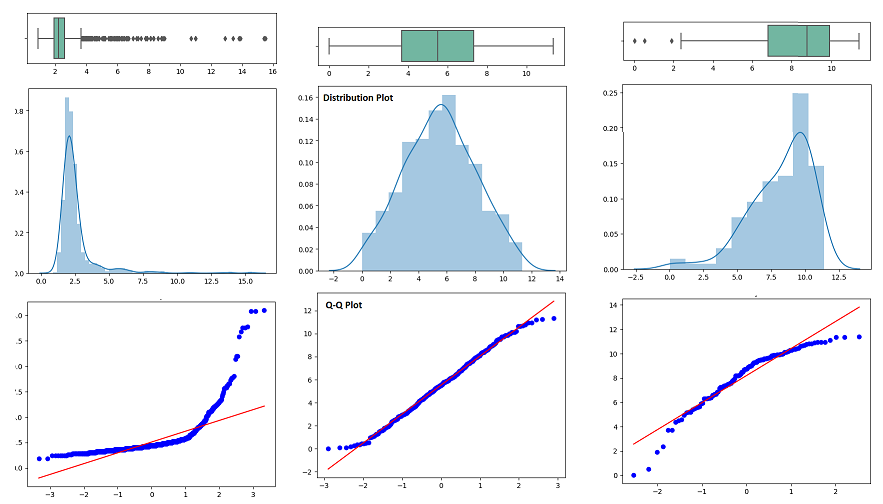

# Feature Transformation
- Log Transform
- Reciprocal Transform
- Square Root Transform
- Box-Cox transformation

Goal is to make our data normal distribution while working with liearRegression, logisticRegression, etc.

## skLearn:
### Function Transformer
- Log Transform `log(x)` :  
1. If there is a **right-skew** data.
2. Strictly positive values.
- Reciprocal Transform `1/x` :
1. It's often applied to features that have a **left-skewed** distribution
2. Strictly positive values.
- Square Root Transform `sqrt(x)` : 

### Power Transformer
- Box-Cox transformation
- Yeo-Johnson

How to find if data is Normal?
- `sns.distplot()`
- `pd.skew() == 0`
- QQ Plot

#### QQ Plot

Here's how to interpret a Q-Q plot to determine if a dataset is approximately normal:
- **Straight Line:** If the points in the Q-Q plot form a straight line, it suggests that the dataset is approximately normally distributed. However, it's important to remember that deviations from a perfect straight line can still occur due to random variation.
- **Curvature**: If the points curve upwards or downwards away from the straight line, it indicates that the dataset has heavier or lighter tails compared to a normal distribution, respectively.
- **S-Shaped Curve**: An S-shaped curve suggests that the dataset has a different shape compared to a normal distribution. For example, if the curve starts low, rises above the straight line, and then falls below it, it indicates that the dataset has a peak that is higher and narrower than a normal distribution (leptokurtic). Conversely, if the curve starts above the straight line, dips below it, and then rises above it again, it indicates that the dataset has a flatter peak than a normal distribution (platykurtic).

Points Off the Line: Individual points that deviate significantly from the straight line may indicate outliers in the dataset.

